## 개요

클라우드포레는 Zabbix와 연동하기 위해 Zabbix Webhook을 제공하고 있습니다.  
본 가이드는 Zabbix에서 보내는 Alert을 클라우드포레로 수신하기 위한 설정 방법을 안내 합니다.  
설정 방법은 아래와 같은 순서로 수행합니다.

[1. Zabbix Webhook 설정(클라우드포레)](./GUIDE.md/#1-zabbix-webhook-설정)  
[2. Zabbix Media 설정(Zabbix)](./GUIDE.md/#2-zabbix-media-설정)  
[3. Users에 Media 설정(Zabbix)](./GUIDE.md/#3-users에-media-설정)  
[4. Trigger actions 설정(Zabbix)](./GUIDE.md/#4-trigger-actions-설정)

Zabbix는 타 서비스와 연동하기 위해 Media라는 기능을 제공하며,  
이 Media에 클라우드포레의 Webhook URL을 명세하여 Zabbix에서 발생하는 Alert을 클라우드포레로 전송이 가능합니다.

<br>
<br>

## 1. Zabbix Webhook 설정

클라우드포레에서 Zabbix Webhook을 생성하면 Webhook URL을 획득할 수 있습니다.  
다음 단계를 통해 알아보도록 하겠습니다.

(1) 클라우드포레의 특정 프로젝트에서 [얼럿]을 클릭 합니다.  
&nbsp;&nbsp;&nbsp;&nbsp;&nbsp;[웹훅] 버튼을 클릭하면 현재 생성된 웹훅 목록을 볼 수 있습니다.  
&nbsp;&nbsp;&nbsp;&nbsp;&nbsp;[+ 추가] 버튼을 클릭하여 새로운 Zabbix Webhook을 생성합니다.

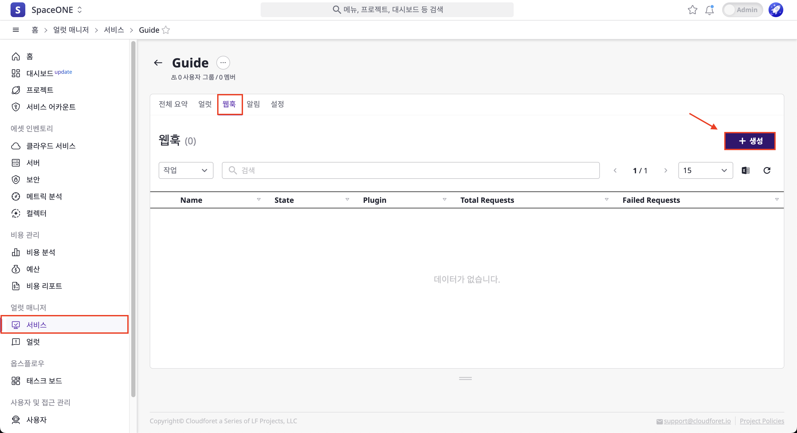

(2) 모달이 열리면 [이름]을 기입하고 [Zabbix Webhook]을 선택 후 [확인] 버튼을 클릭 합니다.

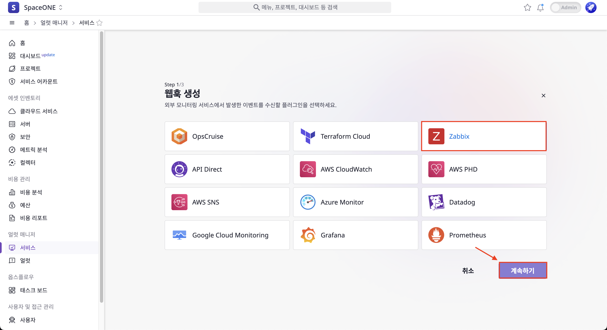

(3) 생성된 Zabbix Webhook을 확인할 수 있습니다.  
&nbsp;&nbsp;&nbsp;&nbsp;&nbsp;`webhook URL`은 Grafana와 연동을 위해 사용됩니다.

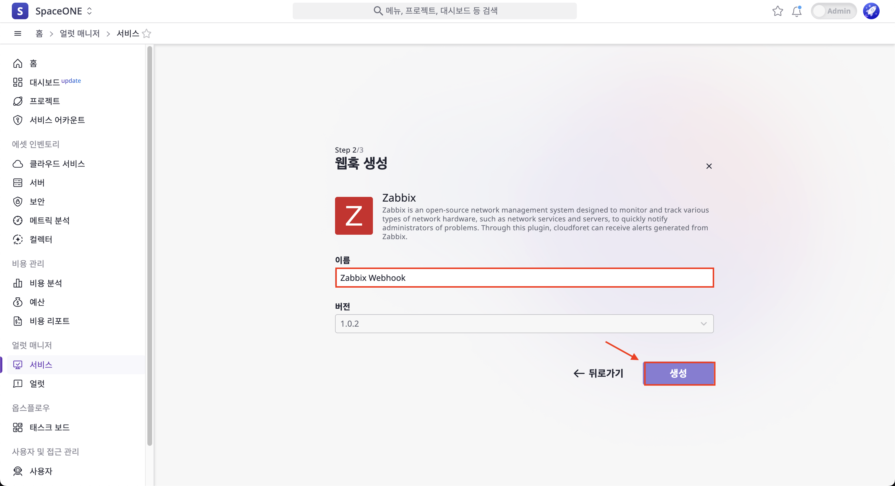

<br>
<br>

## 2. Zabbix Media 설정

Zabbix의 Media를 설정 하겠습니다. 여기서는 클라우드포레에서 생성한 Webhook URL이 사용될 예정입니다.

(1) Zabbix 콘솔 로그인 > [Administration] > [Media types] > [Create media type] 버튼을 클릭 합니다.

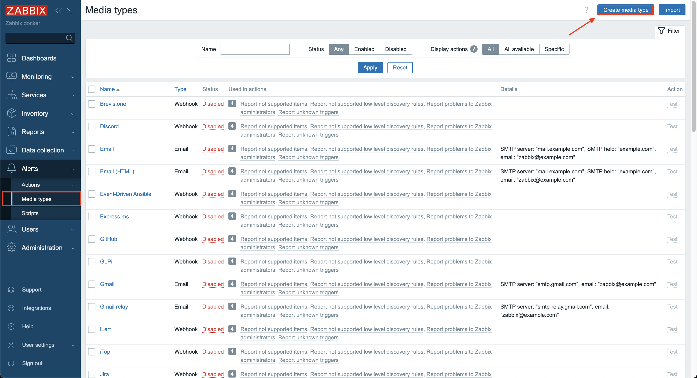

(2) Media type에 대한 세부 설정을 진행 합니다.

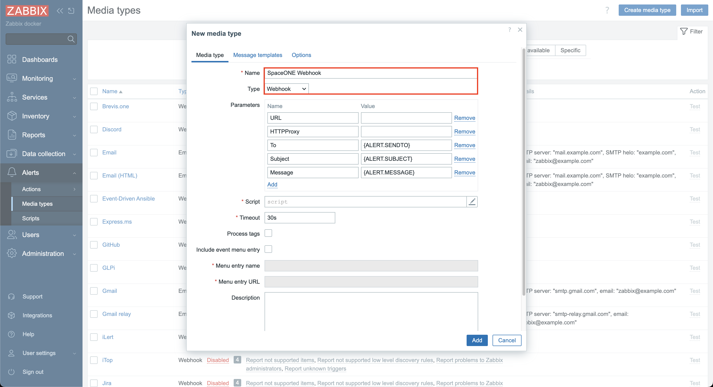

(2-1) 다음으로 Zabbix에서 클라우드포레로 보낼 데이터의 Parameter를 명세 합니다. 아래 그림과 같이 설정 합니다.  
&nbsp;&nbsp;&nbsp;&nbsp;&nbsp;&nbsp;&nbsp;&nbsp;여기서 [Parameters] 중 [Name]이 `webhookURL` 인 것의 [Value]는 [1. Zabbix Webhook 설정(클라우드포레)](./GUIDE.md/#1-zabbix-webhook-설정)에서 획득한 `Webhook URL`을 사용 합니다.


(2-2) [Script]에 아래 코드를 기입 합니다.  
&nbsp;&nbsp;&nbsp;&nbsp;&nbsp;&nbsp;&nbsp;&nbsp;클라우드포레는 Zabbix의 기존 Media 유형 중 만족하는 것이 없기 때문에 이를 처리할 스크립트를 만들어야 합니다.

```javascript
var params = JSON.parse(value),
req = new CurlHttpRequest(),
resp;
req.AddHeader('Content-Type: application/json');

var params = JSON.parse(value);
payload = {};
payload.title = params.title;
payload.message = params.message;
payload.to = params.to;

payload.event = {};
payload.event.id = params.eventID;
payload.event.name = params.eventName;
payload.event.date = params.eventDate;
payload.event.time = params.eventTime;
payload.event.status = params.eventStatus;
payload.event.severity = params.eventSeverity;

payload.item = {};
payload.item.id = params.itemID;
payload.item.key = params.itemKey;
payload.item.value = params.itemValue;

payload.trigger = {};
payload.trigger.id = params.triggerID;
payload.trigger.name = params.triggerName;
payload.trigger.severity = params.triggerSeverity;
payload.trigger.status = params.triggerStatus;

payload.host = {};
payload.host.id = params.hostID;
payload.host.connection_info = params.hostConn;
payload.host.name = params.hostname;
payload.host.visible_name = params.hostVisibleName;


resp = req.Post(params.webhookURL,
JSON.stringify(payload)
	);
return resp;
```

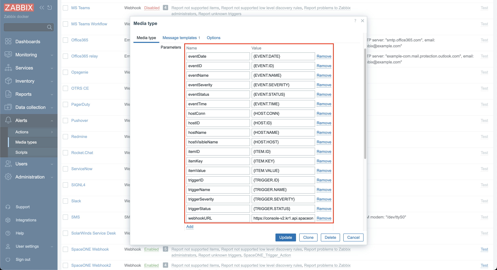

(2-3) [Name], [Type], [Parameters] 그리고 [Script] 작성이 완료되면 [Message templates] 탭으로 이동 합니다.

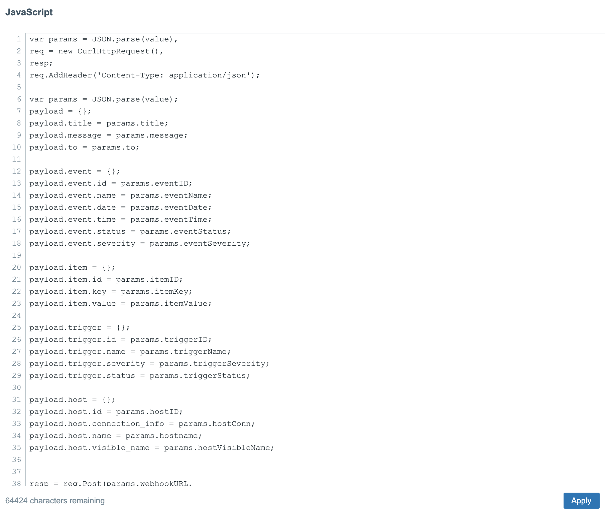

(3) Zabbix에서 제공하는 기본 템플릿 `Problem` , `Problem recovery`  그리고 `Problem update` 를 추가한 후 [Add] 버튼을 클릭 합니다.  
&nbsp;&nbsp;&nbsp;&nbsp;&nbsp;위 기본 템플릿은 Zabbix에서 문제가 생기거나, 문제가 해결됐을 때 혹은 문제가 업데이트 된 경우에 대해  
 &nbsp;&nbsp;&nbsp;&nbsp;&nbsp;전달할 메세지의 Subject, Messaage가 정의 되어 있습니다. 사용자 편의에 맞는 템플릿 변경을 지원합니다.

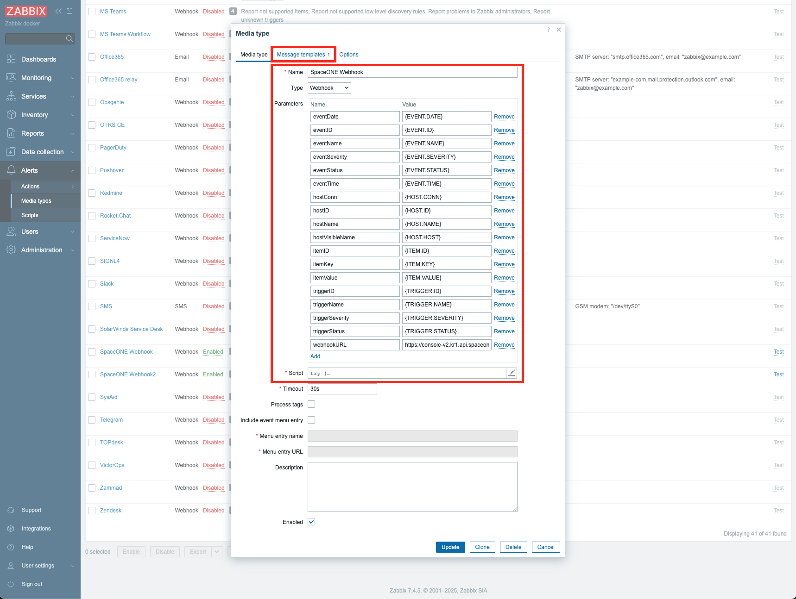

<br>
<br>

## 3. Users에 Media 설정

[2. Zabbix Media 설정(Zabbix)](./GUIDE.md/#2-zabbix-media-설정)에서 생성한 Media를 사용자에 추가해야 합니다.

(1) [Adiministration] > [Users] > [Create user] 버튼을 클릭 합니다.

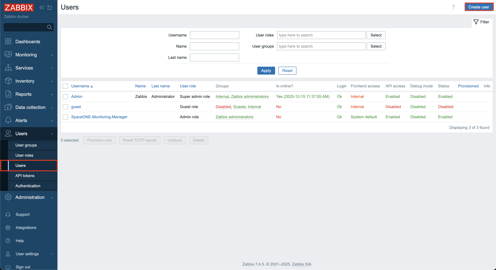

(2) User를 생성할 때 필요한 필수 항목을 모두 기입 합니다. 이후 [Media] 탭으로 이동 합니다.

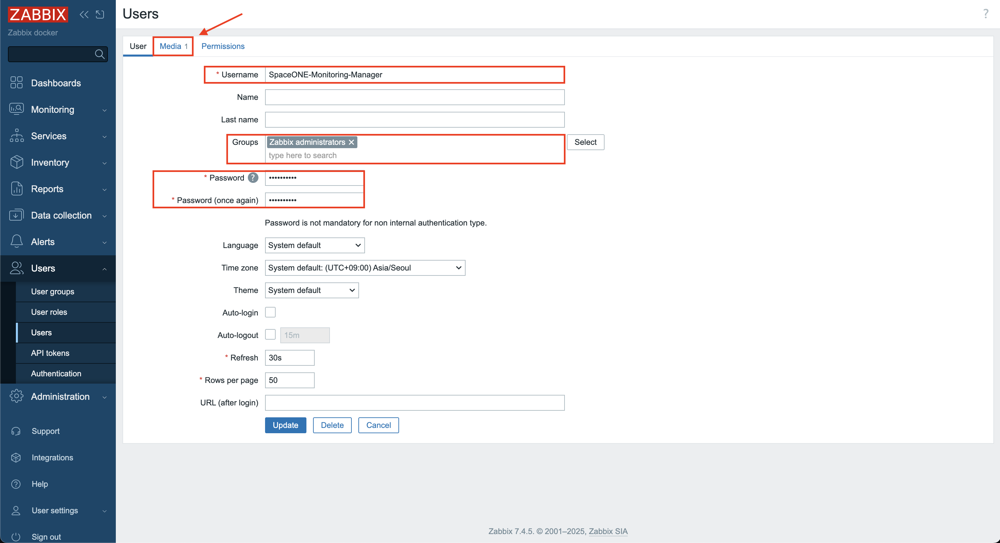

(3) [Type]은 [1. Zabbix Webhook 설정(클라우드포레)](./GUIDE.md/#1-zabbix-webhook-설정)에서 생성한 `CloudForet Webhook`을 선택 합니다.  
&nbsp;&nbsp;&nbsp;&nbsp;&nbsp;[Send to]는 필수 항목 이지만 실제로 사용되지 않는 parameter입니다. 이메일이나 이름으로 기입 합니다.  
&nbsp;&nbsp;&nbsp;&nbsp;&nbsp;[When active]의 기본값은 모든 시간때 알림을 허용하는 것으로 그대로 사용 합니다.  
&nbsp;&nbsp;&nbsp;&nbsp;&nbsp;이후 [Add] 버튼을 클릭 합니다.

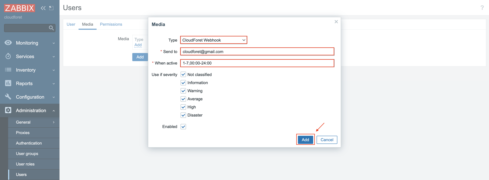

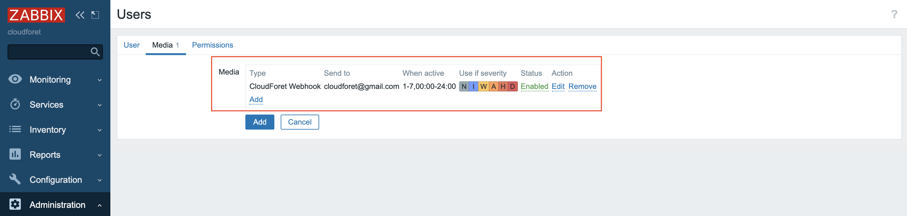

(4) [Permissions] 탭에서 Role을 선택한 후 [Add] 버튼을 클릭 합니다.

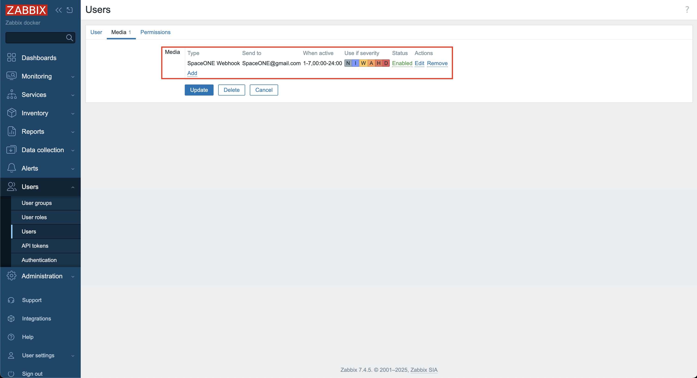

(5) Media가 추가된 User가 생성된 것을 확인할 수 있습니다.

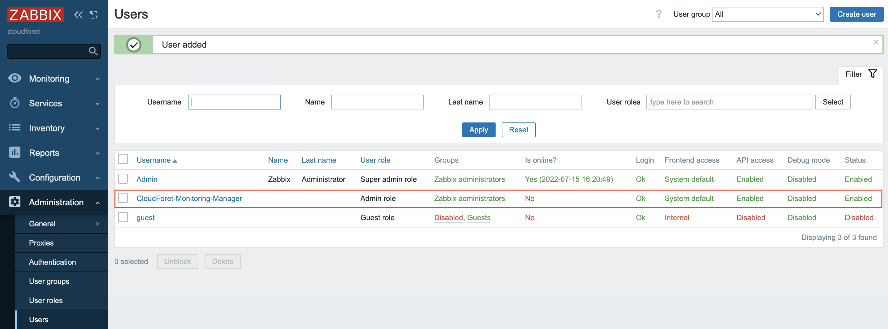

<br>
<br>

## 4. Trigger actions 설정

지금까지 Zabbix에서 Media를 설정하고 user에 생성한 Media를 추가 하였습니다.  
이제 특정 이벤트가 발생하면 Media를 설정한 사용자에게 메세지를 보내도록 `Trigger actions` 을 설정 합니다.

(1) [Configuration] > [Actions] > [Trigger actions] 선택 후 [Create action] 버튼을 클릭 합니다.

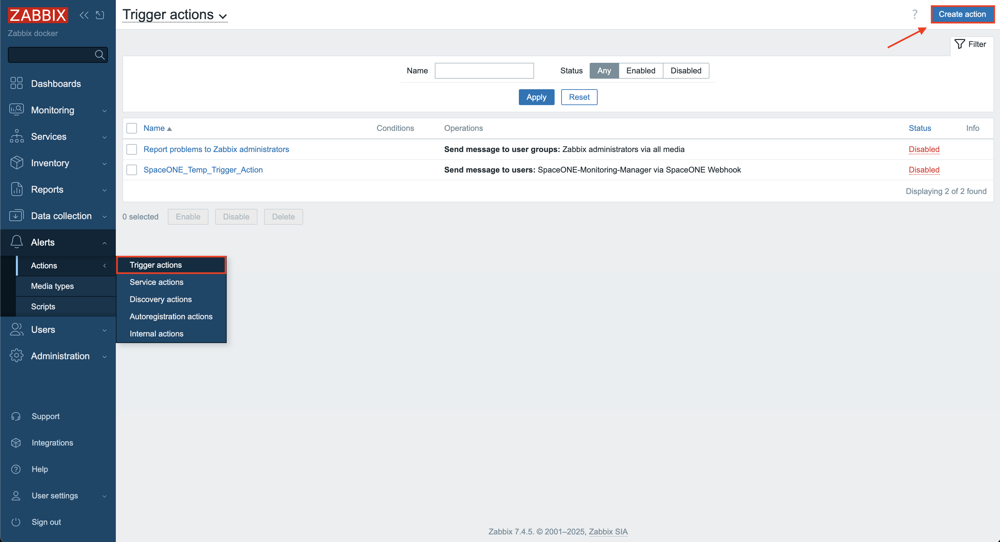

(2)[Name] 기입 후 [Operations] 탭을 선택 합니다.

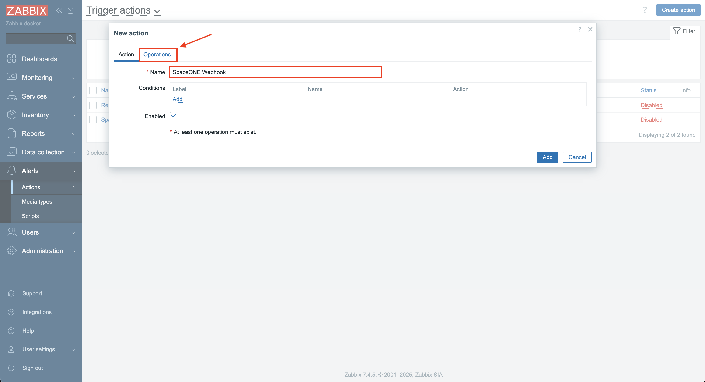

(3)[Operations] > [Add] 버튼을 클릭 합니다.  
&nbsp;&nbsp;&nbsp;&nbsp;&nbsp;[Operation details]에서 [Send to users]와 [Send only to]를 선택해야 합니다.  
&nbsp;&nbsp;&nbsp;&nbsp;&nbsp;이전 가이드에서 생성한 `CloudForet-Monitoring-Manager`와 `CloudForet Webhook`을 선택 합니다.

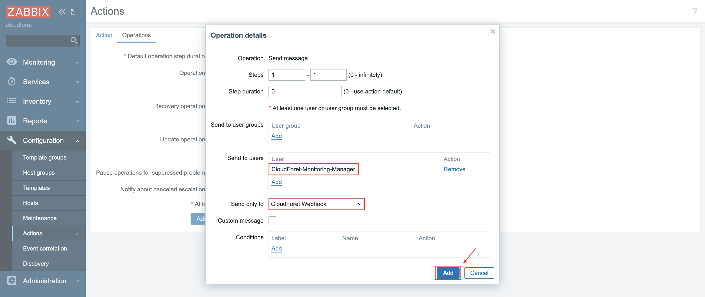

(3-1) [Recovery operations] > [Add] 버튼을 클릭 합니다.  
&nbsp;&nbsp;&nbsp;&nbsp;&nbsp;&nbsp;&nbsp;&nbsp;[Operation details]에서 [Send to users]와 [Send only to]를 선택해야 합니다.  
&nbsp;&nbsp;&nbsp;&nbsp;&nbsp;&nbsp;&nbsp;&nbsp;이전 가이드에서 생성한 `CloudForet-Monitoring-Manager`와 `CloudForet Webhook`을 선택 합니다.

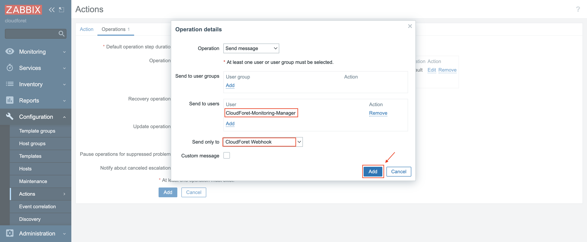

(4) 모든 설정이 완료 되었다면 [Add] 버튼을 클릭 합니다.

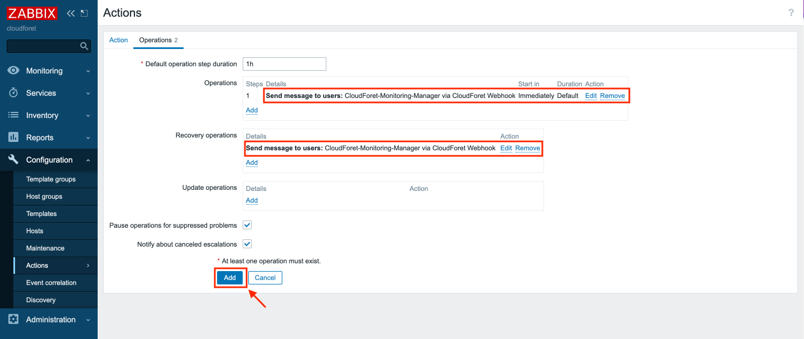

가이드의 설정이 모두 끝났다면 클라우드포레에서 Zabbix의 Alert을 수신 할 수 있습니다.